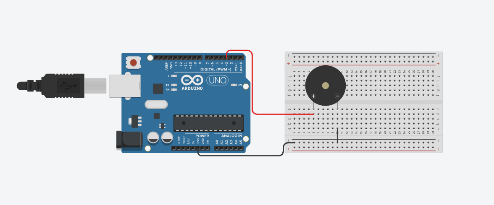

# Projeto do Buzzer para tocar musicas

este projeto foi desenvolvido dentro do Tinkecard, na disciplina de Internet das Coisas 
(IoT), para a criação de um prototipo com arduino que utiliza um Buzzer para tocar
(Do, Re, Mi, Fa).

## Componentes Usados 
- 1 Arduino uno
- 1 Protoboard (Placa de Ensaio)
- 1 Buzzer(Piezo)
- 3 jumpers Macho/Macho

## Montagem de Circuito

## Explicação do Código

int buzzer = 3;
#define doo 262
#define re 294
#define mi 330
#define fa 349

void setup()
{
 > Define buzzer como saida
 pinMode(buzzer, OUTPUT); 
  
}

void loop()
{
  > A FUNCAO DE LIGAR tone()
  tone(buzzer,doo,500);//Tocar o dó
  delay(600);
  tone(buzzer,re,500);//Tocar o ré
  delay(600);
  tone(buzzer,mi,500);//Tocar o mi
  delay(600);
  tone(buzzer,fa,500);//Tocar o fa
  > A FUNCAO DE DESLIGAR notone() 
  noTone(buzzer);

}
