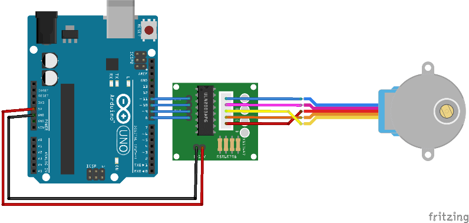

# Projeto de Motor de Passo

este projeto foi desenvolvido dentro do Tinkecard, na disciplina de Internet das Coisas 
(IoT), para a criação de um protótipo de motor de passo que quando ativado roda ate 
a quantidade de Graus escolhida.
## Componentes Usados 

- 1 Arduino uno
- 1 Motor de passo
- 1 Placa Drive
- 6 jumpers Macho/Femea

## Montagem de Circuito 

## Explicação do Código

> Incluir a biblioteca
#include <AccelStepper.h>

> Conversão dde graus para steps
> 360° = 1024
> 180° = 512
> 90° = 256
> 60° = 170
> 45° = 128

> Variavel para controlar as voltas do motor
#define Voltas = 1024
> Criando objeto para controlar o motor
AccelStepper motor (AccelStepper::FULL4WIRE,8,10,9,11)

void setup() {
> Definir a velocidade maxima do motor
 motor.setMaxSpeed(1000);
> Definir aceleração maxima do motor
motor.setAcceleration(100)

}

void loop() {
> Habilitar as portas de controle do moto no arduino
motor.run();
> fazer o motor se movimentar
motor.moveTO(voltas);

}

