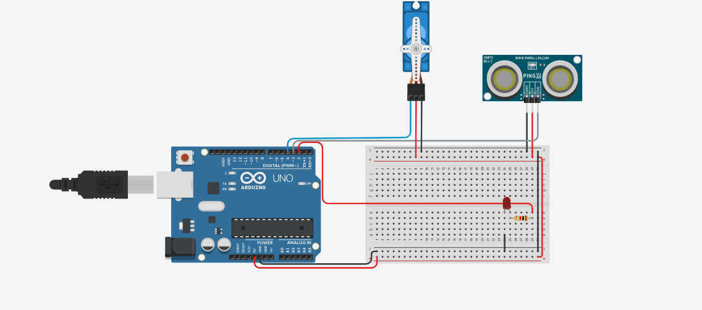

# Projeto de um robo de segurancao utilizando servo e sensor

este projeto foi desenvolvido dentro do Tinkecard, na disciplina de Internet das Coisas 
(IoT), para a criação de um prototipo com arduino que utiliza Servo com um Sensor de
distacia que quando capta um objeto emite um sinal que faz o servo virar para outro lado.

## Componentes Usados 
- 1 Arduino uno
- 1 Protoboard (Placa de Ensaio)
- 1 Micro Servo
- 1 led vermelho
- 1 Resistor
- 1 Sensor de distancia
- 8 jumpers Macho/Macho
- 2 jumpers Macho/Femea

## Montagem de Circuito

## Explicação do Código

> Biblioteca para utilizar o servo
#include <Servo.h>

> Variáveis para o LED, Sensor e Servo Motor
int led = 2;         
int motor = 4;       
int posicao = 0;     > Posição inicial do servo
Servo motorservo;    > Cria um objeto Servo

> Função para medir a distância com um sensor de ultrassom
long distancia(int trigger, int echo) {
  > Configura o pino trigger como saída
  pinMode(trigger, OUTPUT);
  digitalWrite(trigger, LOW);
  delay(5);
  
  > Envia o sinal
  digitalWrite(trigger, HIGH);
  delay(10);
  digitalWrite(trigger, LOW);
  
  > Configura o pino echo como entrada e retorna o tempo do pulso
  pinMode(echo, INPUT);
  return pulseIn(echo, HIGH);
}

void setup() {

  > Conecte o LED, o sensor de distância e o servo motor conforme especificado.
  pinMode(led, OUTPUT);        > Define o LED como saída
  motorservo.attach(motor);    > Inicializa o servo motor
  motorservo.write(posicao);   > Define a posição inicial do servo
}

void loop() {
  > Mede a distância e converte para centímetros
  int cm = 0.01723 * distancia(3, 3);
  
  > Se a distância for menor que 320 cm, acende o LED e move o servo
  if (cm < 320) {
    digitalWrite(led, HIGH);  > Liga o LED
    posicao = posicao + 50;   > Aumenta a posição do servo em 50 graus
    delay(1000);            
    motorservo.write(posicao); > Move o servo para a nova posição
  } else {
    digitalWrite(led, LOW);   > Desliga o LED se não houver objeto próximo
  }
}
