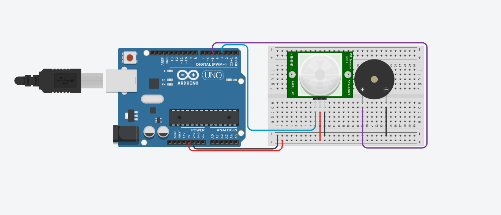

# Projeto de Alarme com sensor de movimento

este projeto foi desenvolvido dentro do Tinkecard, na disciplina de Internet das Coisas 
(IoT), para a criação de um Alarme utilizando sensor de movimento que ao ser ativado 
um Buzzer emite um som em uma frequncia escolhida.

## Componentes Usados 

- 1 Arduino uno
- 1 Protoboard (Placa de Ensaio)
- 1 Sensor PIR
- 1 Buzzer(Piezo)
- 7 jumpers Macho/Macho

## Montagem de Circuito 

## Explicação do Código

>Variavel Sensor de movimento
int SensorPIR = 3;
>Variavel do Buzzer(Piezo)
int Buzzer = 5;

void setup()
{
  > Define sensor de movimento como Entrada
  pinMode(SensorPIR,INPUT);

  > Define Buzzer(Piezo) como saida
  pinMode(Buzzer,OUTPUT);
  
}

void loop()
{

  int detectarPresenca = digitalRead(SensorPIR);  
  if(detectarPresenca == 1){ > Se = 1 o Buzzer vai emitir um som
  tone(Buzzer,264);
  }else{  > Se nao for = 1 o Buzzer continuara sem emitir som 
  noTone(Buzzer);
  }
  
}
