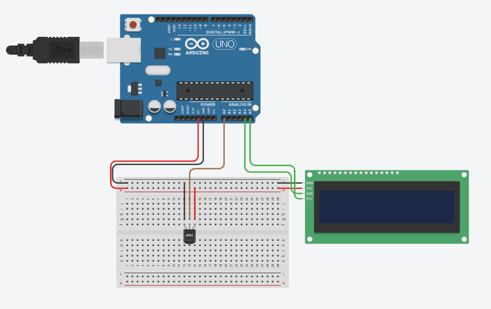

# Projeto de Tela LCD com sensor de Temperatura

este projeto foi desenvolvido dentro do Tinkecard, na disciplina de Internet das Coisas 
(IoT), para a criação de um prototipo com arduino que simule na tela lcd os graus celsius
do ambiente.

## Componentes Usados 
- 1 Arduino uno
- 1 Protoboard (Placa de Ensaio)
- 1 LCD 16x2 (L2C)
- 1 Sensor de Temperatura [TMP36]
- 5 jumpers Macho/Macho
- 4 jumpers Macho/Femea

## Montagem de Circuito

## Explicação do Código

#include <LiquidCrystal_I2C.h>
> IMPORTANDO BIBLIOTECA LCD

> INICIALIZAR LCD
LiquidCrystal_I2C telaLcd (0x20,16,2);

> Variavel do sensor de temperatura
int sensorTMP= A0;
int valorLido = 0;
> Captura temperatura

void setup()
{
  > Definir o sensor como entrada
  pinMode(sensorTMP,INPUT);
  > Ligar a tela LCD
  telaLcd.init();
  > Limpar os dados da tela
  telaLcd.clear();
  > aumenta o brilho da tela lcd
  telaLcd.backlight();
}

void loop()
{
  > captura o valor da temperatura 
  valorLido = analogRead(sensorTMP);
  > Converte valor da tensão
  float tensao = (valorLido*5.0)/1024;
  > Converter a tensao em graus celsius
  float temperatura = (tensao-0.5)*100;
  
  > Imprimir valor da temperatura no LCD
  telaLcd.setCursor(0,0);
  telaLcd.print(temperatura);
 }
