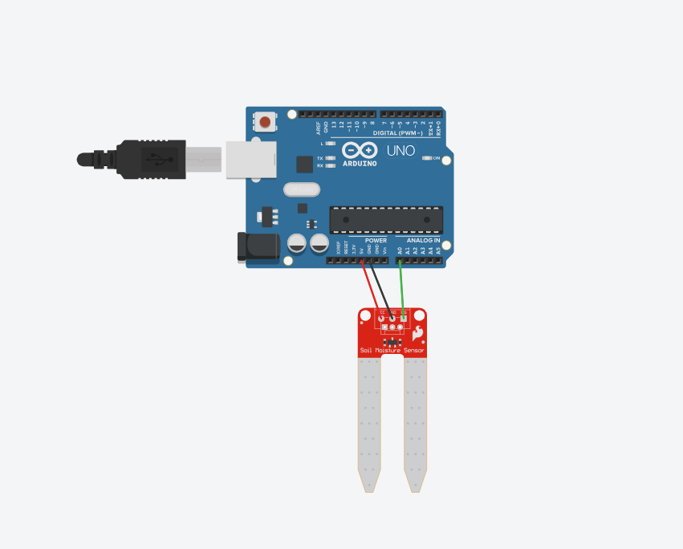

# Projeto de Sensor de umidade do solo

este projeto foi desenvolvido dentro do Tinkecard, na disciplina de Internet das Coisas 
(IoT), para a criação de um prototipo com arduino que usa um sensor de umidade do solo 
para ultizar em locais como (estufas,jardins,etc.).

## Componentes Usados 
- 1 Arduino uno
- 1 Sensor de umidade do solo
- 3 jumpers Macho/Macho

## Montagem de Circuito

## Explicação do Código

> Biblioteca para conexão serial do sensor
#include <SoftwareSerial.h>

> Variável do sensor
int sensor = A0;

void setup() {
  > Definir o sensor como entrada
  pinMode(sensor, INPUT);
  
  > Utilizando o monitor serial
  Serial.begin(9600);
}

void loop() {
  > Guardar o valor lido pelo sensor em uma variável
  int umidade = analogRead(sensor);

  > Verificando os níveis de umidade
  if (umidade < 300) {
    Serial.print("Solo esta SECO | ");
    Serial.print("UMIDADE => ");
    Serial.println(umidade);
  } 
  
  if (umidade >= 300 && umidade <= 500) {
    Serial.print("Solo esta IDEAL | ");
    Serial.print("UMIDADE => ");
    Serial.println(umidade);
  } 
  
  if (umidade > 500) {
    Serial.print("Solo esta UMIDO | ");
    Serial.print("UMIDADE => ");
    Serial.println(umidade);
  }

  delay(1000);
}
