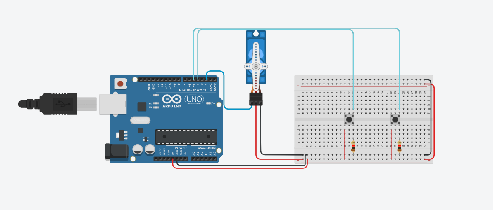

# Projeto de Servo motor com botões

este projeto foi desenvolvido dentro do Tinkecard, na disciplina de Internet das Coisas 
(IoT), para a criação de um prototipo com arduino que utiliza Servo com botões que quando 
pressionado faz a ativação do servo.

## Componentes Usados 
- 1 Arduino uno
- 1 Protoboard (Placa de Ensaio)
- 1 Micro Servo
- 2 Botões
- 2 Resistor
- 11 jumpers Macho/Macho

## Montagem de Circuito

## Explicação do Código

 > Biblioteca do servo motor
#include <Servo.h>

 > Criando objeto do tipo Servo Motor
paa poder usar as funções de controle 
do equipamento(servo motor)

Servo objetoservo;
 > Variavel para salvar a porta que o servo esta conectado

int servo = 2;

 > variavel para porta do motor 
int botao = 4;
int botao2 = 5;

 >variavel para posição do motor
int posicao = 0;

void setup()
{

  > A inicialização do servo na porta 2
  objetoservo.attach(servo);
  > definir botão como entrada
  pinMode(botao,INPUT);
  objetoservo.write(posicao);
}

void loop()
{
 > Se precionar o botão, gire o serve a X posiçoes
  if(digitalRead(botao)== HIGH && posicao<180){
    
  > Entao aumente X posiçoes 
  posicao = posicao +20;
    
  > Mande o motor para a nova posicao 
  objetoservo.write(posicao);
  delay(1000);
  } 
  if(digitalRead(botao2)== HIGH && posicao > 0){
    
  > Entao aumente X de posiçaes 
  posicao = posicao -20;
    
  > Mande o motor para a nova posicao 
    objetoservo.write(posicao);
    delay(1000);
  } 

}
